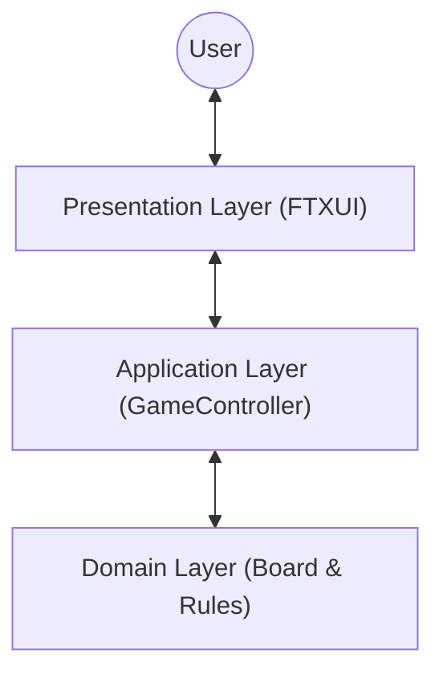

# 🎮 Tricky (Tic-Tac-Toe)

> A modern, terminal-based Tic-Tac-Toe game built with **C++23** and **FTXUI**, featuring a clean **MVC Architecture**.

**Tricky** reimagines the classic "Tres en Raya" for the terminal. Unlike standard command-line games, it offers a responsive TUI (Text User Interface) with mouse support, keyboard navigation, and a scalable codebase designed with modern software engineering practices.

## ✨ Features

- **🛡️ Modern C++23:** Utilizes cutting-edge features like `std::expected`, `std::span`, `concepts`, and `std::format`.
- **🏗️ Clean Architecture:** Strict separation of concerns using the **Model-View-Controller (MVC)** pattern.
    - **Core:** Pure logic, zero UI dependencies.
    - **UI:** Reactive rendering layer.
- **🖱️ Interactive UI:** Full mouse and keyboard support within the terminal.
- **🎨 Dynamic Layout:** Responsive grid with real-time state updates.
- **📊 Score Tracking:** Persistent scoreboard during the session.

## 📐 Architecture

The project is structured to ensure scalability and maintainability:



- **Domain (`Core::Board`):** Holds the grid state and validates rules.
- **Application (`Core::GameController`):** Manages game flow, turns, and score.
- **Presentation (`UI::GameUI`):** Renders the interface and captures input.

## 🛠️ Prerequisites

- **C++ Compiler:** GCC 13+, Clang 16+, or MSVC (VS2022) with C++23 support.
- **CMake:** Version 3.25 or higher.
- **Git:** To fetch dependencies.

## 🚀 Building and Running

1.  **Clone the repository:**
    ```bash
    git clone https://github.com/MrTanuk/tricky-tui.git
    cd tricky-tui
    ```

2.  **Configure and Compile:**
    ```bash
    mkdir build && cd build
    cmake ..
    cmake --build .
    ```

3.  **Run the game:**
    ```bash
    ./app/tricky_app
    ```

## 🕹️ Controls

| Input | Action |
|-------|--------|
| **Mouse Left Click** | Place Mark (X/O) or Select Menu Option |
| **Arrow Keys** | Navigate the Grid or Menu |
| **Enter** | Confirm Selection |

## 📂 Project Structure

```text
.
├── app/
│   └── main.cpp          # Dependency Injection entry point
├── include/
│   ├── core/             # Business Logic (Headers)
│   └── ui/               # Presentation Logic (Headers)
├── src/
│   ├── core/             # Implementation of Board & Controller
│   └── ui/               # Implementation of FTXUI Rendering
└── CMakeLists.txt        # Modern CMake configuration
```

## 🤝 Contributing

Contributions are welcome! Whether it's implementing an AI player or adding network support.

## 📝 License

This project is licensed under the MIT License.
